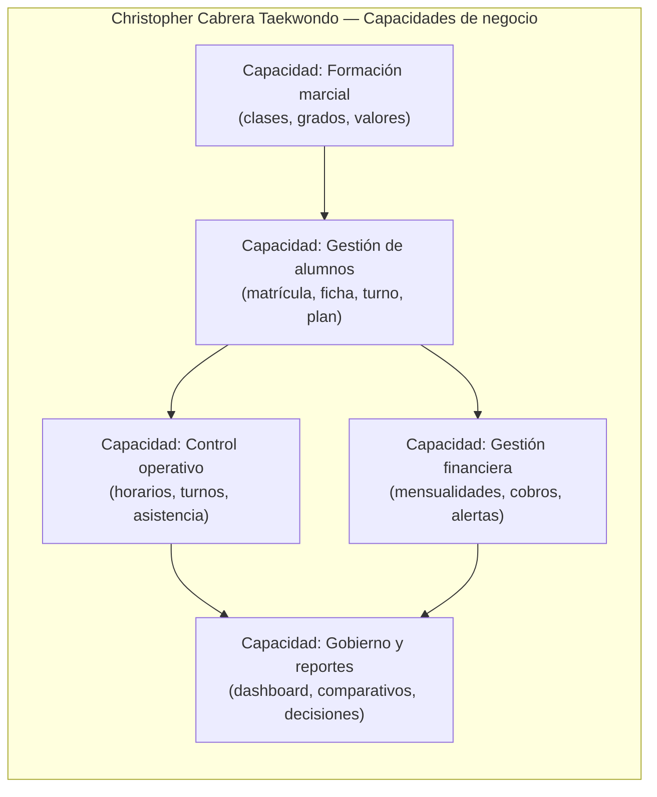
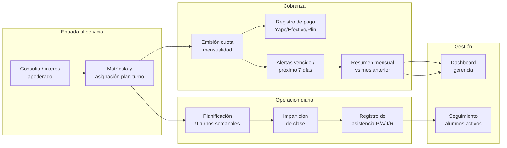
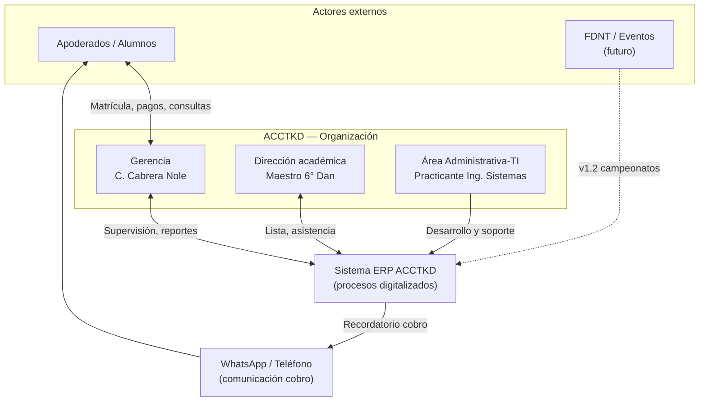
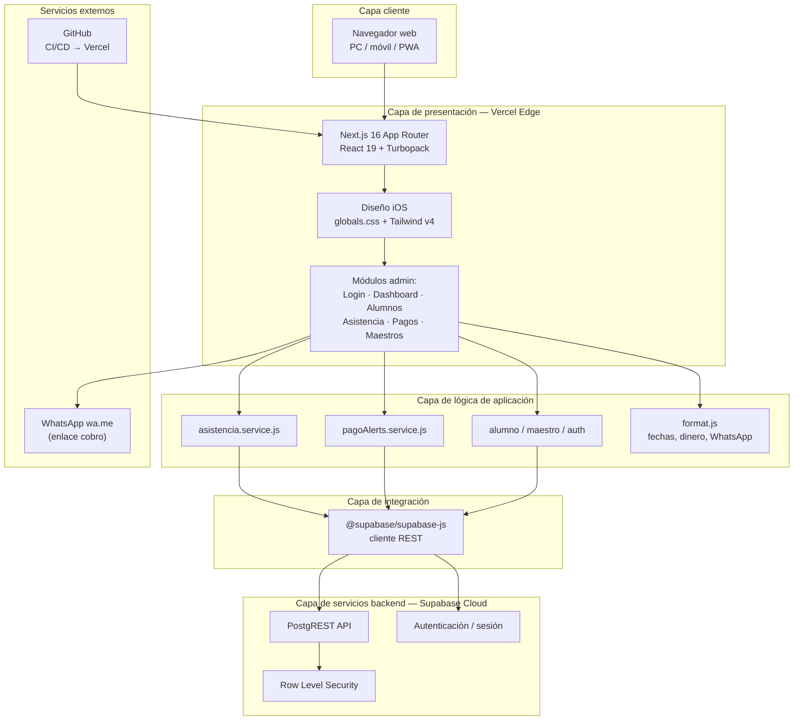
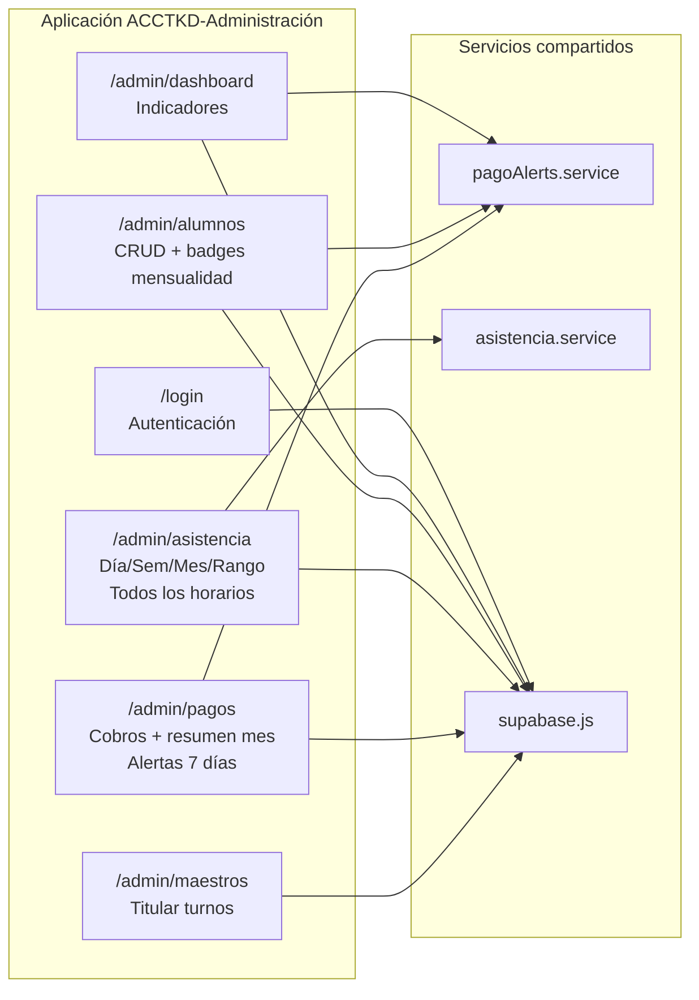
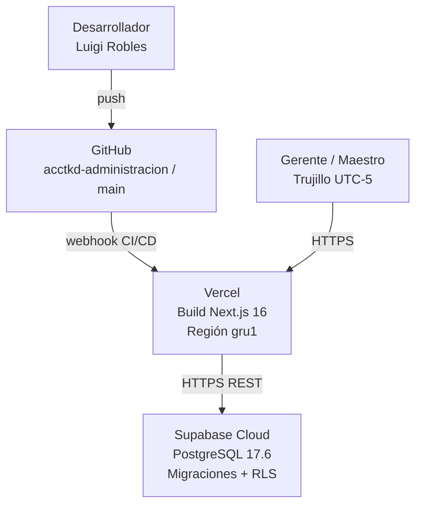
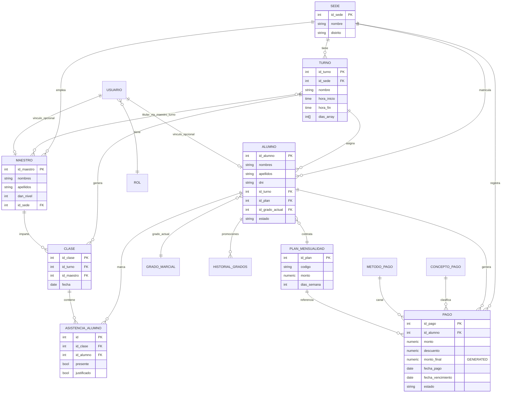
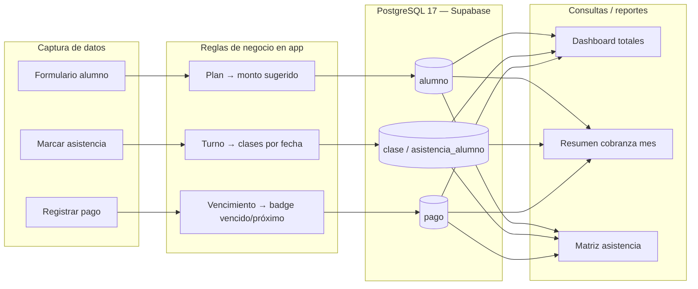
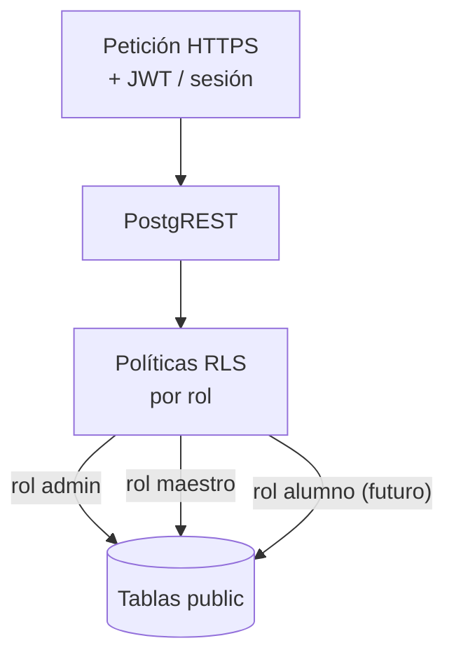
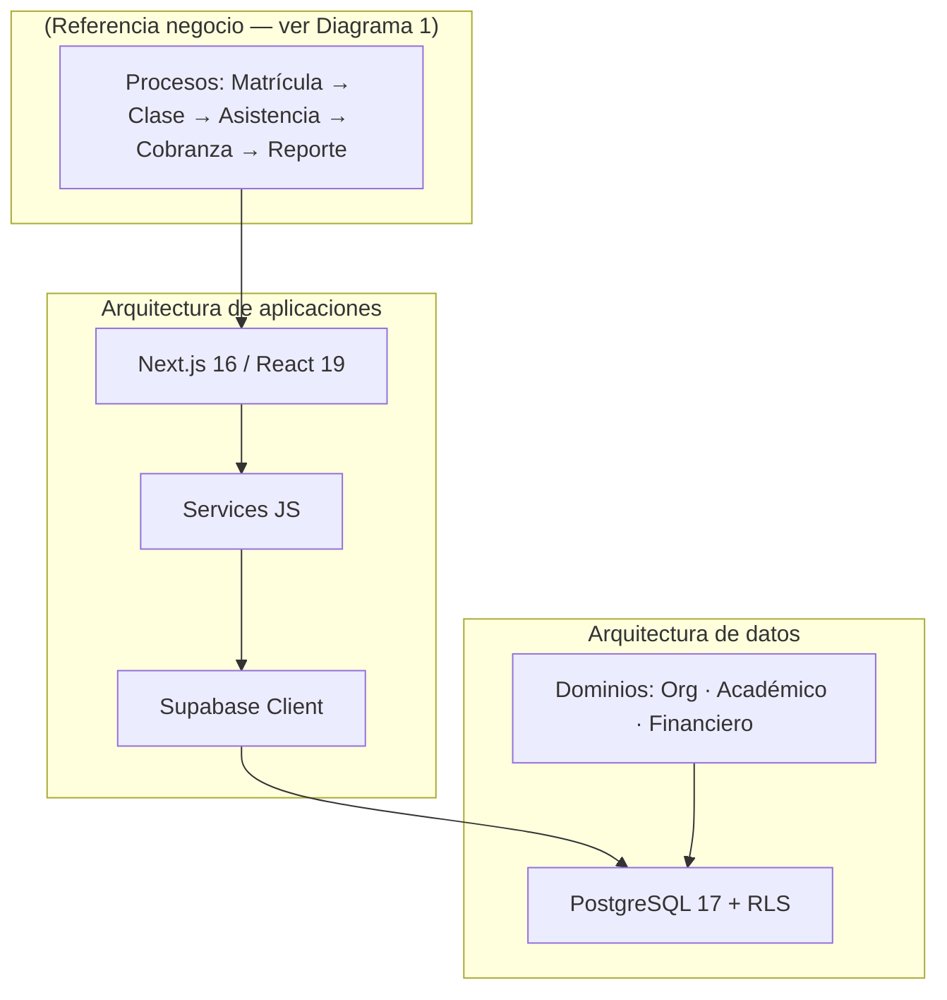

# Diagramas de arquitectura — Proyecto ACCTKD ERP v1.0

**Practicante:** Robles Palacios, Luigi Armando  
**Empresa:** Christopher Cabrera Taekwondo (ACCTKD)  
**Docente:** Fernando Santiago Gonzales Zavaleta  
**Proyecto:** Sistema Web ERP «ACCTKD» — gestión de alumnos, asistencias y cobranza  
**Fuente:** Elaboración propia con base en el informe de prácticas y la implementación v1.0 (mayo 2026)

> **Nota sobre el enunciado:** La evaluación solicita diagramas de **arquitectura de negocio**, **arquitectura de aplicaciones** y **arquitectura de datos**. A continuación se presentan **tres diagramas** (uno por capa arquitectónica). Si el docente pide exactamente dos figuras, pueden combinarse **Aplicaciones + Datos** en una sola lámina técnica (ver Diagrama 2 compuesto al final).

---

## Diagrama 1 — Arquitectura de negocio

### 1.1 Descripción

La **arquitectura de negocio** representa **qué hace la academia**, **quién participa** y **cómo fluye la información** entre procesos, sin detallar tecnología. ACCTKD es una microempresa deportiva cuyo valor principal es la formación marcial; la capa de negocio del ERP digitaliza cuatro macroprocesos: **académico-operativo**, **cobranza**, **seguimiento deportivo** y **soporte a la gerencia**.

### 1.2 Actores del negocio

| Actor | Rol | Interacción con el ERP |
|--------|-----|-------------------------|
| **Gerente / Representante legal** (Christopher Cabrera Nole, 6° Dan) | Toma decisiones, supervisa ingresos y operación | Usuario principal: dashboard, pagos, alumnos, reportes |
| **Maestro titular** | Imparte clases, pasa lista | Asistencia por turno (móvil) |
| **Practicante TI** (Luigi Robles) | Soporte, evolución del sistema | Desarrollo, despliegue, migraciones |
| **Apoderado / Alumno** | Beneficiario del servicio | Indirecto v1.0 (WhatsApp cobro); portal futuro v1.3 |
| **Entidades externas** | FDNT, campeonatos, medios de pago | Referencia futura (exámenes, eventos) |

### 1.3 Capacidades de negocio (Business Capabilities)

### 1.4 Mapa de procesos de negocio (macroprocesos)

### 1.5 Diagrama de contexto de negocio (organización + sistema)

**Figura 1: Arquitectura de negocio — capacidades, procesos y contexto organizacional**  
*Fuente: Elaboración propia.*

---

## Diagrama 2 — Arquitectura de aplicaciones

### 2.1 Descripción

La **arquitectura de aplicaciones** describe **cómo se organiza el software**: capas, módulos, servicios, integraciones y despliegue. ACCTKD v1.0 sigue una arquitectura **JAMStack serverless** de tres capas: presentación (Next.js 16), lógica de aplicación (servicios JS) y persistencia (Supabase/PostgreSQL).

### 2.2 Vista por capas lógicas

### 2.3 Vista de componentes por módulo funcional

### 2.4 Vista de despliegue (deployment)

**Figura 2: Arquitectura de aplicaciones — capas, módulos y despliegue**  
*Fuente: Elaboración propia.*

---

## Diagrama 3 — Arquitectura de datos

### 3.1 Descripción

La **arquitectura de datos** define **qué información se almacena**, **cómo se relaciona** y **cómo se protege**. ACCTKD centraliza datos en PostgreSQL 17 administrado por Supabase, organizados en dominios: **maestros/catálogos**, **operacionales transaccionales** y **seguridad/acceso**.

### 3.2 Dominios de datos

| Dominio | Tablas principales | Propósito |
|---------|-------------------|-----------|
| **Organización** | sede, turno, maestro, maestro_turno | Estructura física y horaria de la academia |
| **Académico** | alumno, grado_marcial, historial_grados, clase, asistencia_alumno | Matrícula, progreso marcial, asistencia |
| **Financiero** | plan_mensualidad, pago, concepto_pago, metodo_pago, descuento | Cobranza y trazabilidad de pagos |
| **Seguridad** | usuario, rol + políticas RLS | Acceso por rol (admin, maestro, alumno, organizador) |
| **Extensión v1.2+** | campeonato, examen_programado, comunicado | Roadmap |

### 3.3 Modelo entidad-relación (núcleo v1.0)

### 3.4 Flujo de datos — procesos críticos

### 3.5 Seguridad de datos (RLS)

**Figura 3: Arquitectura de datos — dominios, modelo ER, flujos y seguridad**  
*Fuente: Elaboración propia.*

---

## Diagrama 2 compuesto (opción: dos láminas para entrega)

Si el docente exige **exactamente dos diagramas**, usar:

| Lámina | Contenido |
|--------|-----------|
| **Diagrama 1** | Toda la sección «Arquitectura de negocio» (Figura 1) |
| **Diagrama 2** | «Arquitectura de aplicaciones» (capas + despliegue) **+** «Arquitectura de datos» (ER + flujo) en una sola figura técnica |

---

## Texto para insertar en el informe (Capítulo III — sección 3.2.3 a 3.2.4)

### Arquitectura de negocio

La arquitectura de negocio del proyecto ACCTKD describe los procesos que la academia necesita sostener: matrícula y asignación de plan-turno, operación de clases en nueve horarios semanales, control de asistencia, emisión y seguimiento de mensualidades, y generación de reportes para la gerencia. Los actores principales son el gerente (Christopher Cabrera Nole), el maestro titular, el practicante de sistemas y los apoderados. El ERP no reemplaza la relación humana de la academia, sino que ordena la información que antes permanecía en cuadernos, hojas sueltas y archivos Excel.

### Arquitectura de aplicaciones

La solución se implementó con arquitectura de tres capas serverless: (1) presentación en Next.js 16 desplegado en Vercel; (2) lógica encapsulada en servicios JavaScript (`asistencia.service.js`, `pagoAlerts.service.js`, entre otros); (3) persistencia en Supabase Cloud con PostgreSQL 17.6 y Row Level Security. Los módulos funcionales corresponden a login, dashboard, alumnos, asistencia, pagos y maestros. La integración con WhatsApp se realiza mediante enlaces `wa.me` generados desde el módulo de pagos.

### Arquitectura de datos

Los datos se organizan en dominios de organización (sede, turno, maestro), académico (alumno, grado, clase, asistencia) y financiero (plan, pago, concepto, método). El modelo relacional garantiza integridad referencial; el campo `monto_final` de la tabla `pago` es calculado automáticamente. Al cierre de la v1.0 la base productiva administra 1 sede, 9 turnos, 60 alumnos, 366 clases, 770 asistencias y 144 pagos. Las políticas RLS segmentan el acceso según rol de usuario.

---

## Métricas de referencia (mayo 2026)

- 1 sede · 9 turnos · 3 planes (S/100, S/130, S/180)
- 60 alumnos (55 activos) · 1 maestro titular 6° Dan
- 366 clases · 770 asistencias · 144 pagos
- Repo: https://github.com/luigirobles04/acctkd-administracion
- Deploy: https://acctkd-administracion.vercel.app

---

*Elaborado por Robles Palacios, Luigi Armando — UCV Ingeniería de Sistemas — Mayo 2026.*
