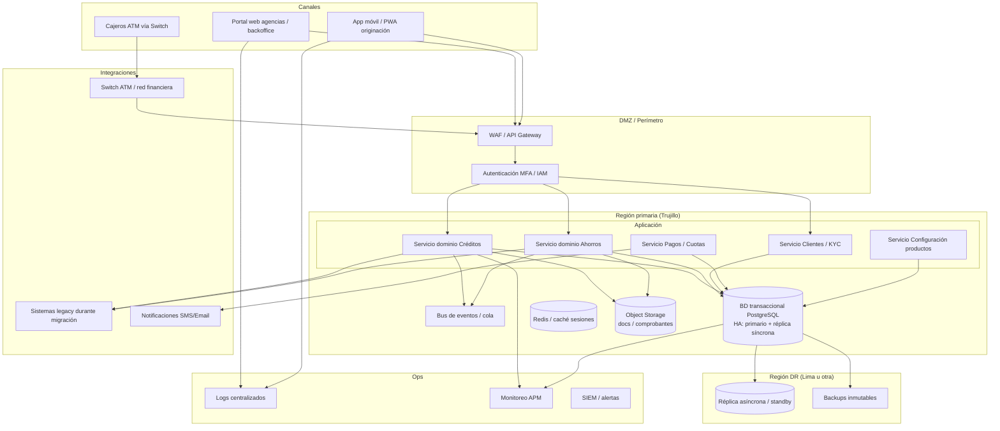
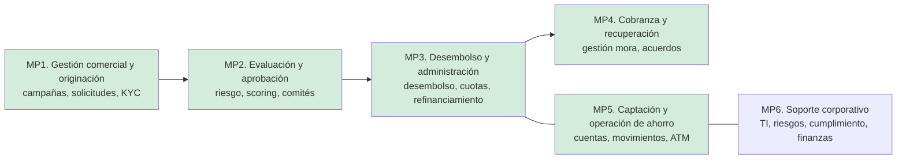
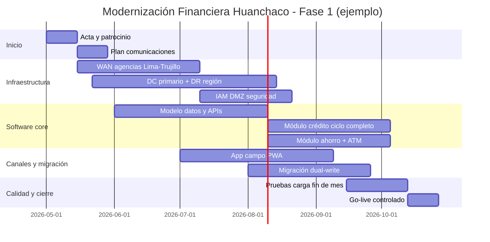

# Propuesta de solución — Caso Financiera Huanchaco  
**Prácticas Preprofesionales I (PLC IV)** · Producto: *Propuesta de solución del caso de estudio*  
**Rol asumido:** Jefatura de Tecnologías de la Información  

---

## Metodología declarada (para alinear con la rúbrica)

Se aplica un **marco híbrido explícito**, documentado en cada entregable:

| Ámbito | Marco / estándar de referencia |
|--------|----------------------------------|
| Alcance, tiempo, calidad, riesgos del proyecto | **PMBOK / PMI** (plan de proyecto, EDT, cronograma, plan de calidad) |
| Requerimientos | **ISO/IEC/IEEE 29148** (clasificación, trazabilidad, criterios de aceptación) |
| Procesos de negocio | **BPMN 2.0** (macroprocesos y relación con capacidades de TI) |
| Arquitectura de software | **Modelo C4** — en esta prueba, **diagrama de contexto + contenedores + componentes** |
| Continuidad y gobierno | **ISO 22301** (continuidad de negocio), **COBIT 2019** y **ITIL 4** (prácticas de operación y gobierno) |

> **Supuesto de caso:** “Cantidad de tiendas” del Anexo 3 se interpreta como **cantidad de agencias/sucursales** por distrito; el total operativo se alinea al enunciado (**10 agencias**) consolidando oficinas bajo la sede de Trujillo como un **hub** con varios puntos de atención, sin contradecir la expansión a Lima descrita.

---

## CE1 — Preguntas 1 y 2

### 1. Lista de requerimientos del negocio

**Formato:** ID · Enunciado · Tipo (F/NF) · Prioridad (MoSCoW) · Fuente (caso)

| ID | Requerimiento | Tipo | Prioridad | Fuente |
|----|---------------|------|-----------|--------|
| RN-01 | Operar **crédito** y **ahorro** sobre una **única base de datos corporativa** centralizada, con acceso desde todas las agencias (norte + Lima). | F | Must | Caso |
| RN-02 | Soportar el **ciclo crediticio completo**: solicitud, preevaluación, evaluación, aprobación, desembolso, cobranza de cuotas, cancelación (Anexo 1). | F | Must | Anexo 1 |
| RN-03 | Soportar **ahorro**: apertura, depósitos, retiros, consultas, baja (Anexo 2); clientes **personas naturales y jurídicas**. | F | Must | Anexo 2 |
| RN-04 | Permitir **configuración flexible** de nuevos **tipos de producto crediticio** (hoy: personal, hipotecario, nuevos negocios, mi campaña, corporativos). | F | Must | Caso |
| RN-05 | Reemplazar operación **off-line** en tabletas obsoletas por **captación conectada** (app/PWA o app nativa) con **sincronización controlada** y registro de origen por agencia/usuario. | F | Must | Caso |
| RN-06 | Integrar **cajeros automáticos (ATM)** con **cuentas de ahorro** y consultas mínimas autorizadas, vía **conmutador/switch** o proveedor certificado. | F | Must | Caso |
| RN-07 | Ejecutar **migración de datos** (clientes, créditos, ahorros, históricos) **sin detener operaciones** (estrategia por fases, dual-write o ventanas controladas). | F | Must | Caso |
| RN-08 | Mejorar **rendimiento y disponibilidad** del gestor crediticio (lentitud y caídas a fin de mes). | NF | Must | Caso |
| RN-09 | Interconectar sede Trujillo y agencias Lima con **enlaces dedicados/VPN** y **segmentación de red** (DMZ para canales). | NF | Must | Caso |
| RN-10 | Definir **sitio de recuperación** (centro externo en otra región) y **copias fuera de sitio** para desastres. | NF | Must | Caso |
| RN-11 | Cumplir **trazabilidad y auditoría** de acciones sensibles (aprobaciones, cambios de tasas, reversos, acceso a datos). | NF | Must | Buenas prácticas |
| RN-12 | **Clasificar información** y aplicar controles por nivel (confidencial, restringido, público) en diseño y operación. | NF | Must | Rúbrica / Caso |

**Criterios de aceptación (ejemplo IEEE 29148):** *Dado* una solicitud registrada en cualquier agencia, *cuando* exista conectividad, *entonces* debe quedar en la BD corporativa en **< 5 s** p95 y con **id de correlación** trazable en auditoría.

---

### 2. Diagrama de componentes del sistema propuesto (vista C4 — Componentes)

Interpretación: **API Core** (dominio financiero), **integraciones**, **canales**, **plataforma de datos**, **observabilidad y seguridad**.

**Elementos tecnológicos explícitos:** API Gateway, IAM/MFA, microservicios por dominio (o módulos monolíticos modulares si se prioriza simplicidad), PostgreSQL HA, Redis, cola/bus, object storage, réplica DR, backups WORM/inmutables, integración ATM, observabilidad (APM, SIEM).

---

## CE2 — Preguntas 3 y 4

### 3. Diagrama de macroprocesos (BPMN conceptual)

Macroprocesos y **beneficio** del sistema propuesto (**✓** = optimización directa).

- **MP1–MP4 (crédito):** ✓ Menos fricción off-line, tiempos de respuesta, trazabilidad, un solo libro de clientes/productos.  
- **MP5 (ahorro):** ✓ Integración ATM, consistencia en tiempo casi real, menos errores de conciliación.  
- **MP6:** ✓ Gobierno de datos, continuidad, seguridad perimetral y monitoreo de fin de mes.

---

### 4. Modelo de datos propuesto (tablas y atributos principales)

**Convención:** PK = clave primaria, FK = clave foránea, UK = único.

| Tabla | Descripción | Atributos principales |
|-------|-------------|------------------------|
| **agencia** | Sucursales descentralizadas | `agencia_id` PK, `codigo`, `nombre`, `distrito`, `region`, `jefe_agencia_id` FK |
| **usuario_sistema** | Personal y roles | `usuario_id` PK, `agencia_id` FK, `rol`, `estado`, `ultimo_acceso` |
| **cliente** | Superentidad cliente | `cliente_id` PK, `tipo` (N/J), `estado`, `fecha_alta`, `riesgo` |
| **persona_natural** | Datos PN | `cliente_id` PK/FK, `doc_tipo`, `doc_numero` UK, `nombres`, `apellidos`, `fecha_nac` |
| **persona_juridica** | Datos PJ | `cliente_id` PK/FK, `ruc` UK, `razon_social`, `representante_id` FK |
| **cuenta_ahorro** | Producto ahorro | `cuenta_id` PK, `cliente_id` FK, `agencia_id` FK, `saldo`, `estado`, `moneda` |
| **movimiento_ahorro** | Depósitos/retiros | `mov_id` PK, `cuenta_id` FK, `tipo`, `monto`, `fecha`, `canal` (ventanilla/ATM/app), `referencia` |
| **producto_credito_config** | Tipos configurables | `producto_id` PK, `codigo`, `nombre`, `tasa_base`, `plazo_max`, `politica_scoring_id` FK |
| **solicitud_credito** | Originación | `solicitud_id` PK, `cliente_id` FK, `producto_id` FK, `monto`, `estado`, `agencia_id` FK |
| **evaluacion_credito** | Preevaluación/evaluación | `eval_id` PK, `solicitud_id` FK, `tipo`, `resultado`, `puntaje`, `dictamen`, `evaluador_id` FK |
| **credito** | Crédito vigente | `credito_id` PK, `solicitud_id` FK UK, `monto_desembolsado`, `saldo`, `tasa`, `estado` |
| **plan_cuotas** | Cronograma | `cuota_id` PK, `credito_id` FK, `nro`, `fecha_venc`, `capital`, `interes`, `estado` |
| **cobranza_evento** | Pagos y gestión | `pago_id` PK, `cuota_id` FK, `fecha_pago`, `monto`, `canal`, `comprobante` |
| **atm_transaccion** | Traza ATM | `atm_tx_id` PK, `cuenta_id` FK, `terminal_id`, `tipo`, `monto`, `fecha`, `id_externo_switch` |
| **auditoria** | Trazabilidad | `audit_id` PK, `entidad`, `entidad_id`, `accion`, `usuario_id`, `fecha`, `payload_hash` |

**Relaciones clave:** `cliente` 1—1 `persona_natural` o `persona_juridica`; `cliente` 1—N `cuenta_ahorro`; `solicitud_credito` 1—N `evaluacion_credito`; `solicitud_credito` 1—1 `credito`; `credito` 1—N `plan_cuotas`.

---

## CE3 — Preguntas 5 y 6

### 5. Tecnologías (software, hardware, comunicaciones)

| Categoría | Tecnología / estándar | Para qué sirve en Huanchaco |
|-----------|------------------------|-----------------------------|
| **Comunicaciones** | Enlaces **MPLS / Internet dedicado** + **VPN IPsec** site-to-site | Conectar Trujillo–Lima con QoS mínimo para core bancario ligero |
| **Red LAN** | Switches administrados, **VLAN** (voz, datos, invitados), **802.1X** | Segmentación por agencia |
| **Perimetro** | **Firewall NGFW**, **WAF**, **IDS/IPS** | Proteger API y portales |
| **Compute** | **Kubernetes** (o VMs en hipervisor) en DC primario + sitio DR | Ejecutar servicios con escalado horizontal |
| **BD** | **PostgreSQL** (Patroni/etcd o equivalente) + **PgBouncer** | Transacciones ACID, HA |
| **Caché / sesión** | **Redis** cluster | Sesiones y lecturas calientes |
| **Mensajería** | **Kafka** o **RabbitMQ** | Eventos de dominio, desacoplar cobranza/notificaciones |
| **Almacenamiento** | **S3-compatible** (MinIO / cloud) | Documentos y comprobantes |
| **API** | **REST** + **OpenAPI**, **OAuth2/OIDC** | Integración canales y terceros autorizados |
| **IAM** | **Keycloak** o IdP corporativo + **MFA** | Gobierno de identidades |
| **Canales** | **PWA/React** o **Flutter** en tabletas reemplazo | Originación conectada en campo |
| **ATM** | Integración vía **switch** certificado + protocolo del proveedor | Consultas y retiros autorizados |
| **Observabilidad** | **Prometheus/Grafana**, **ELK/OpenSearch**, **APM** | Fin de mes: detección temprana |
| **CI/CD** | **GitLab CI** o **GitHub Actions** | Calidad repetible |
| **Backups** | Copias **inmutables**, pruebas de restauración trimestrales | Ransomware y errores humanos |

---

### 6. EDT (Estructura de desglose del trabajo) — términos del caso

**Proyecto:** *Modernización integrada Financiera Huanchaco (crédito + ahorro + canales + DR)*  

1. **Inicio y gobierno del proyecto**  
   1.1 Acta de constitución y patrocinio Directorio  
   1.2 Plan de comunicaciones (Gerencia Operaciones, TI, Agencias Lima/Trujillo)  
2. **Levantamiento y transición**  
   2.1 Inventario de datos y tablas legacy (clientes, créditos, ahorros)  
   2.2 Estrategia migración **sin parada** (fases, reconciliación)  
3. **Arquitectura e infraestructura**  
   3.1 Red WAN agencias **Los Olivos, Comas, SJL (×2)** ↔ **Trujillo**  
   3.2 DC primario endurecido + **sitio DR otra región**  
   3.3 Hardening, IAM, segmentación **DMZ** para ATM/API  
4. **Solución de software**  
   4.1 Módulo **solicitud → cobranza** (Anexo 1)  
   4.2 Módulo **ahorro** (Anexo 2) + límites ATM  
   4.3 **Configuración de productos** (incl. *mi campaña*)  
5. **Canales**  
   5.1 Sustitución tabletas obsoletas por **app conectada**  
   5.2 Integración **cajeros** con cuentas  
6. **Calidad y seguridad**  
   6.1 Pruebas de carga **fin de mes simulado**  
   6.2 Clasificación de datos y controles por nivel  
7. **Operación y cierre fase 1**  
   7.1 Runbooks y **plan continuidad** operativo  
   7.2 Cierre administrativo y lecciones aprendidas  

**Explicación breve:** La EDT sigue el **camino crítico** *infraestructura → núcleo datos → servicios → canales → migración → pruebas de estrés operativo*, porque el caso exige **continuidad** y **una sola BD corporativa**.

---

## CE4 — Preguntas 7 y 8

### 7. Diagrama de Gantt (alineado al EDT)

*Duraciones orientativas en **semanas**; ajustar según calendario real del docente.*

**Dependencias clave:** `c1` usa resultados de `2.1` inventario; `d2` no inicia sin APIs estables (`c2`, `c3`); `e1` valida el dolor del caso (lentitud/cierres).

---

### 8. Plan de calidad de entregables (vinculado al Gantt)

**Referencias:** PMBOK (Gestión de la calidad), **ISO 9001:2015** (enfoque a procesos), prácticas **Shift-left**.

| Entregable (del Gantt) | Criterio de calidad | Técnica de aseguramiento | Control / verificación |
|------------------------|---------------------|---------------------------|-------------------------|
| WAN y DR | Disponibilidad objetivo acordada, latencia acotada | Diseño revisado (arquitectura), pruebas de failover | Prueba trimestral DR documentada |
| APIs crédito/ahorro | Contrato estable, regresión mínima | **OpenAPI** + pruebas contractuales, **CI** | Gates: no merge sin tests |
| Migración datos | Paridad contable / saldos | Reconciliaciones automáticas, muestreo | Reporte de diferencias = 0 crítico |
| App campo | Usabilidad en agencia, offline mínimo | UAT con **Jefes de Agencia** | Lista de aceptación firmada |
| ATM | Trazabilidad y no repudio | Logs + conciliación con switch | Conciliación diaria |
| Prueba fin de mes | p95 latencia y error rate | **Prueba de carga** + APM | Informe con umbrales |

**Buenas prácticas explícitas:** revisión de código, análisis estático (SAST), escaneo dependencias, gestión de secretos (vault), ambientes (dev/test/preprod), **Definition of Done** por sprint/hito.

---

## CE5 — Preguntas 9 y 10

### 9. Plan de continuidad del servicio (proyección 5 años) + gobernanza

**Horizonte:** 2026–2031. **Marcos:** ISO 22301, COBIT (APO12/BAI04), ITIL (continuidad).

| Año | Estrategia | Detalle |
|-----|------------|---------|
| **2026** | Baseline | BIA simplificado (MP crédito/ahorro), **RTO/RPO** por servicio, DR en segunda región, backups inmutables, runbooks |
| **2027** | Madurez | Simulacros semestrales, automatizar failover de lectura, catalogo de activos críticos |
| **2028** | Resiliencia | Multi-AZ / multi-región activo-pasivo para BD, chaos engineering controlado en preprod |
| **2029** | Optimización | Mejora de RPO con réplicas más cercanas; consolidación de proveedores críticos |
| **2030–2031** | Gobernanza | Auditorías internas anuales, indicadores continuidad en comité de riesgos Directorio |

**Gobernanza TI (COBIT/ITIL):** roles RACI entre **Gerencia Operaciones** (dueño del dato) y **TI** (custodio); políticas de acceso; gestión de cambios para fin de mes; gestión de incidentes con escalamiento a Gerencia General.

---

### 10. Clasificación de datos por confidencialidad (basado en modelo pregunta 4)

| Nivel | Definición | Ejemplos en el sistema | Controles mínimos |
|-------|------------|-------------------------|-------------------|
| **Confidencial** | Divulgación ilegítima causa daño grave a cliente o entidad | `doc_numero`, `ruc`, scoring interno, historial mora, credenciales, llaves API, backups completos | Cifrado en tránsito y en reposo, MFA, need-to-know, masking en QA, DLP, retención legal |
| **Restringido** | Uso interno; no publico masivo | `saldo`, `monto` crédito, `plan_cuotas`, nombres agencia+asesor, informes operativos | RBAC por rol, auditoría, segmentación red, logs sin datos sensibles en claro |
| **Público** | Puede difundirse sin riesgo material | Código de agencia, horario de atención, descripción genérica de productos *sin tasas personalizadas* | Integridad (firma web), CDN cacheable |

**Sustento:** la normativa financiera y la protección de datos personales exigen minimizar exposición de identidad y situación económica; por eso identificadores y saldos no son “públicos”.

---

## Competencias genéricas

### CG1 — Pregunta 11: Dos estrategias de aprendizaje

1. **Aprendizaje basado en retos (PBL) aplicado al caso:** formar un **caso de estudio interno mensual** que replique “fin de mes” con datos anonimizados; el equipo TI–Operaciones documenta lecciones. *Justificación:* acelera comprensión de cuellos de botella reales y reduce riesgo en producción.  
2. **Comunidades de práctica + microlearning:** 30 min/semana sobre **PostgreSQL HA**, **patrones de migración** y **seguridad API**. *Justificación:* distribuye el conocimiento y evita dependencia de una sola persona (riesgo operativo).

---

### CG2 — Pregunta 12: Resumen ejecutivo (un párrafo)

Financiera Huanchaco requiere sostener su expansión en Lima y modernizar simultáneamente los sistemas de **crédito** y **ahorro** bajo una **base de datos corporativa única**, reemplazando la originación obsoleta en modo off-line y conectando **cajeros automáticos** a las cuentas, sin interrumpir operaciones. La propuesta consiste en una **arquitectura modular** con servicios por dominio, infraestructura **alta disponibilidad**, **sitio de recuperación en otra región** y un **programa de migración por fases** con pruebas de carga orientadas a los picos de fin de mes, complementado con **gobierno de datos** y **clasificación de confidencialidad** para cumplir expectativas del Directorio y mitigar riesgos de desastres en el norte del país.

---

### CG3 — Pregunta 13: Factibilidad técnica (para decisión de implementación)

| Criterio | Evaluación | Evidencia / acción |
|----------|------------|---------------------|
| **Disponibilidad de skills** | **Alta** | Stack estándar (PostgreSQL, APIs, K8s); mercado local de proveedores |
| **Compatibilidad migración** | **Media–Alta** | Requiere inventario y ETL; mitigable con dual-write y reconciliación |
| **Integración ATM** | **Media** | Dependiente de proveedor switch; riesgo en tiempos de certificación |
| **Red WAN** | **Alta** | Presupuesto aprobado; diseño MPLS/VPN maduro |
| **DR regional** | **Alta** | Directorio ya lo exige; cloud o colocation viable |
| **Riesgo residual** | **Fin de mes** | Mitigar con pruebas de carga y observabilidad desde preprod |

**Conclusión:** el proyecto es **técnicamente factible** con riesgos acotados si se ejecuta por fases y se prioriza el camino crítico de datos y redes antes del go-live masivo en Lima.

---

### CG4 — Pregunta 14: Dos estrategias de equipo y personales

1. **Equipo — Scrum of Scrums quincenal** entre **TI, Operaciones y una agencia piloto (ej. Los Olivos)** para alinear prioridades y destrabar integraciones.  
2. **Personal — disciplina de documentación en vivo** (decisiones de arquitectura ADR) para que el conocimiento sobreviva rotación de consultores.

---

### CG5 — Pregunta 15: Dos estrategias de investigación

1. **Revisión sistemática breve** de **patrones de migración** ( strangler fig, dual-write ) aplicados a instituciones financieras pequeñas; matriz comparativa riesgo/beneficio.  
2. **Estudio de caso comparativo** de **dos proveedores ATM/switch** con criterios: certificación, SLA, costo total, soporte en Perú.

---

## Cómo presentarlo para apuntar a “Notable” en la rúbrica

- Nombra la **metodología** en la portada o introducción (esta sección inicial).  
- En **CE1–CE2**, muestra **trazabilidad**: cada bloque de requerimientos conecta con un componente/proceso/tabla.  
- En **CE4**, que el plan de calidad cite **entregables concretos del Gantt** (como en la tabla).  
- En **CE5**, menciona **normas o guías** (ISO 22301, COBIT) aunque sea en una línea.  
- Revisa redacción y ortografía antes de entregar (la rúbrica CG2 penaliza errores de código escrito).

---

*Documento generado como plantilla de estudio / entrega; adapta fechas, nombres de proveedor y métricas RTO/RPO a lo que acuerdes con tu docente.*
